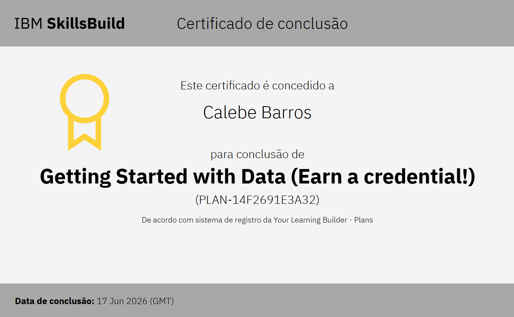

# 🗄️ Banco de Dados - ETECVAV


---

## 👨‍🎓 Aluno
- 👱🏻 Calebe Barros Ramalho da Silva

---

## 🎓 Instituição
**ETECVAV**  
Escola Técnica Estadual Vasco Antônio Venchiarutt

---

## 💳 Certificado

<p align="center">
  
</p>

🔗 [Ver certificados oficial](https://skills.yourlearning.ibm.com/certificate/share/a4a62e0b26ewogICJvYmplY3RJZCIgOiAiUExBTi0xNEYyNjkxRTNBMzIiLAogICJsZWFybmVyQ05VTSIgOiAiNzk3OTI5OFJFRyIsCiAgIm9iamVjdFR5cGUiIDogIkFDVElWSVRZIgp9ccb6d2e563-10)


---

## 📘 Disciplina
**Banco de Dados**

---

## 📌 Sobre o Repositório
Este repositório foi criado para armazenar atividades, projetos, exercícios e estudos desenvolvidos durante as aulas de Banco de Dados.

Aqui estarão reunidos conteúdos relacionados à modelagem de dados, DERs e estruturas de bancos de dados desenvolvidas durante a disciplina.

---

## 🛠️ Ferramentas Utilizadas
- 🗂️ BRModelo
- 📝 Word
- 📊 PowerPoint
- 📄 Ferramentas derivadas do Office

---

## 📂 Estrutura do Repositório
```bash
📁 atividades/
📁 projetos/
📁 modelos/
📁 estudos/
```

---

## 🚀 Objetivo
Desenvolver habilidades relacionadas à modelagem e estruturação de bancos de dados, aplicando conceitos teóricos e práticos ao longo do curso.

---

## 📬 Contato
📧 **Email:** calebebarros108@gmail.com

---

## 🤝 Grupo INFONET ACDK

🔗 **Repositório do Grupo:**  
[Projeto INFONET - ETECVAV](https://github.com/ACDK-ETECVAV/ETECVAV-AULAS-1D)

📧 **Email do Grupo:**  
aleatorizando29@gmail.com
